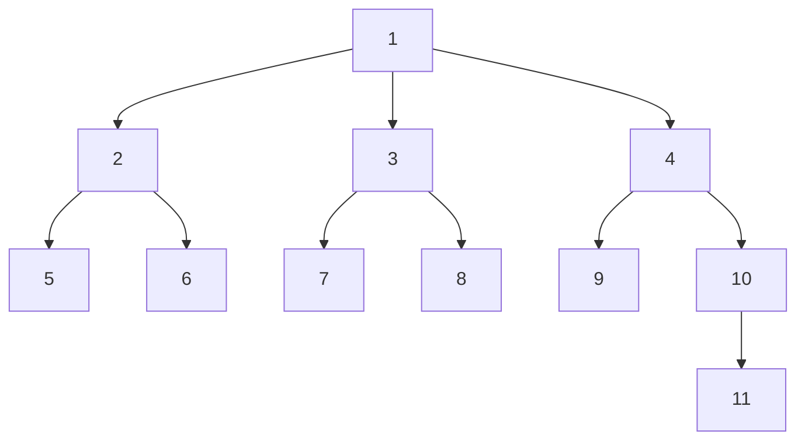





Tree algorithms are very common in many Computer Science problems and by knowing the basic concepts and algorithms you can apply them to solve specific problems.

Let's start to define what a **Tree** is. According to [^1], a tree is:

> [...] a data structure that stores elements hierarchically. With the exception of the top element, each element in a tree has a **parent** element and zero or more **children** elements.

Some examples of trees could be:

1. Your own family tree
2. Your company's organizational chart
3. A filesystem

And here a graphical example:



<!--more-->

## Definitions

1. **Leaf**: a `node` without children
2. **Height**: the number of levels until the `leaf` at the very bottom

In the previous example,

1. **Leafs**: `5, 6, 7, 8, 9, 11`
2. **Height**: `3`

## Traversal

As if we had an array, we can "*iterate*" through the tree nodes, called ***tree traversal***. There are two common ways to do it:

1. Depth-First Search (DFS)
2. Breadth-First Search (BFS)

## DFS

As it name suggests, ***depth first search*** visits all the nodes from the top to the leafs, branch by branch, *i.e.* it selects a branch and goes deeper until reach a leaf, then it selects the next branch and so on. In the previous example, a DFS starting from 1 will visit the following nodes in order:

$$
1 \rightarrow 2 \rightarrow 5 \rightarrow 6 \rightarrow
3 \rightarrow  7 \rightarrow 8 \rightarrow
4 \rightarrow 9 \rightarrow 10 \rightarrow 11
$$

### Iterative algorithm

This kind of visit can be implemented using a **stack**, performing the following actions (with the assumption you start at the root):

1. Append the `root` to the stack
2. While the stack is not empty:
   1. **Pop** the `node` at the top of the stack
   2. Perform any action to the `node`
   3. **Push** all the `children` of `node` in the stack (in reverse order for an *ordered* visits)
   4. Repeat the process

### Recursive algorithm

A recursive algorithm could be implemented as follows:

**DFS(node):**

1. Perform any action to `node`
2. for each `node` in `node.children`:
   1. `DFS(node)`

`DFS(root)`

## BFS

Also known as ***level order traversal***. Instead of exhausting branch by branch as in DFS, BFS goes through all the branches in each "step" by visiting all the nodes on the same level and goes doing that until it reaches the last level, *i.e.* when all the nodes on the current level are leafs.

In the previous example, BFS would visit the nodes in the following order:

$$
1 \rightarrow 2 \rightarrow 3 \rightarrow 4 \rightarrow 5 \rightarrow
6 \rightarrow 7 \rightarrow 8 \rightarrow 9 \rightarrow 10 \rightarrow 11
$$

```
Level 0: 1
Level 1: 2 -> 3 -> 4
Level 2: 5 -> 6 -> 7 -> 8 -> 9 -> 10
Level 3: 11
```

### Algorithm

1. Create an empty `queue`
2. Append to the `queue` the `root`
3. While the `queue` is not empty:
   1. **Pop** the `node` at the front of the `queue`
   2. Perform any action to the `node`
   3. **Enqueue (append)** all the `children` of `node` to the queue
   4. Repeat the process

## Code example

There are many ways to code a tree, depending on the type of tree you will be using you can store it in an array, using linked lists or simple chained objects.

I put an example of an object oriented approach to code a tree datastructure, using python:

```python
from collections import namedtuple
from collections import deque

Node = namedtuple('Node', 'value, children')

def dfs(node, callback):
  callback(node)
  
  if not node.children: return
  for child in node.children: dfs(child, callback)

def dfs_iterative(root, callback):
  stack = [root]
  
  while stack:
    node = stack.pop()
    callback(node)
    
    if node.children:
      for child in reversed(node.children): stack.append(child)

def bfs(root, callback):
  queue = deque([root])
  
  while queue:
    node = queue.popleft()
    callback(node)
    
    if node.children:
      for child in node.children: queue.append(child)
```

Instead of creating a **class**, I wrapped the **Node** data structure into a **namedtuple**[^2] and implemented the previous mentioned algorithms with the help of the Python's collection *deque* API.

To see the code running I created two online notebooks:

1. [Python version at **Google Colab**](https://colab.research.google.com/drive/1rozliZ9LeviOMW-_GvuPriqZcXxnvtfM)
2. [Javascript version at **Observable**](https://beta.observablehq.com/@gomezhyuuga/computer-science-tree-algorithms)

## References

[^1]: Goodrich, M. T., & Tamassia, R. (2015). *Algorithm Design and Application*. Wiley.

[^2]: [https://docs.python.org/3.5/library/collections.html#collections.namedtuple]()


